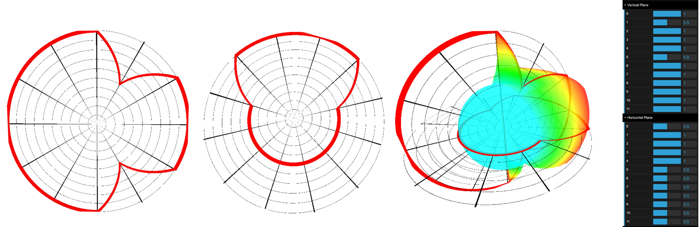
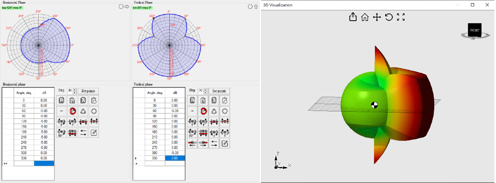

# Antenna Pattern Editor

An interactive web-based tool for designing and visualizing antenna radiation patterns. Users can edit both vertical and horizontal planes, then instantly preview the combined result in an intuitive 3D visualization.



# Quick start

## Development Environment Setup

```
docker run --rm -it -v .:/app -w /app -p 5173:5173 node:20 bash
yarn
yarn dev
```

## Build

```
yarn build
```

# References

- [Antenna Pattern Editor 3.0](https://www.wireless-planning.com/antenna-pattern-editor)


